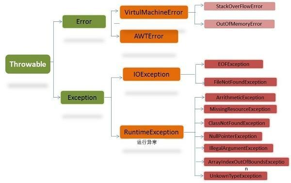

## Java 进阶知识

### 异常



- Error

  - 是程序无法处理的错误，表示运行应用程序中较严重问题。

- Exception

  - 是程序本身可以处理的异常。

- java中的异常处理机制

  - 捕获异常

  - ```java
    try {  
        // 可能会发生异常的程序代码  
    } catch (Type1 id1){  
        // 捕获并处置try抛出的异常类型Type1  
    }catch (Type2 id2){  
        //捕获并处置try抛出的异常类型Type2  
    }finally {  
    }
    ```

  - 抛出异常

  - ```java
    throw new MyException("这是一个异常");//异常信息
    ```

- **示例**

```java
try{
  //业务逻辑代码
}catch(RuntimeException e){ //先catch子类错误
  System.out.println(e.getMessage()); //输出异常信息
  e.printStackTrace(); //把该异常的跟踪栈信息输出到控制台
}catch(Exception e){ //再catch父类错误
  System.out.println(e.getMessage()); //输出异常信息
}finally{
  //一般做回收资源的操作
}
```

```java
public void test() throws IOException{
	//出现IO错误就抛出，让上一级调用这个test方法的程序处理
  	//如果已经是最顶层的程序，比如main方法，那异常就会交给JVM处理，他会打印错误，并且中止程序
}
```

- **自定义的异常**

```java
public class MyException extends Exception{
        public MyException(){
        }

        public MyException(String message){
            super(message);
        }
	}

    public class Test {
        public void display(int i) throws MyException{
            if(i == 0){
                throw new MyException("该值不能为0");
            }else{
                System.out.println( i / 2);
            }
        }

        public static void main(String[] args) {
            Test test = new Test();
            try {
                test.display(0);
            } catch (MyException e) {
                e.printStackTrace();
            }
        }
    }
```

- **注意点**

  - 不要在finally块中处理返回值

  ```java
  try{
    //因为finally中包含了return语句
    //所以return true失去作用
    return true;
  }finally{
    return false;
  }
  ```

  - 不要在构造函数中抛出异常。
  - 尽可能的减小try块


### 泛型

- **泛型类**

```java
//原来的样子
public class Container{
      private String key;
      private String value;
      public Container(String k,String v){
                key=k;
                value=v;
      }
      public String getKey(){
             return key;
      }
      public Stirng setKey(){
             this.key=key;
      }
      public String getValue(){
                return value;
      }
      public String setValue(){
                this.value=value;
      }
}
```

```java
//使用泛型来代替自己的变量类型
public class Container<k,V>{
        private k key;
        private V value;
        public Container(K k,V v){
                key=k;
                value=v;
        }
        public K getkey(){
                return key;
        }
        public V getValue(){
                  return value
        }
        public void setKey(){
                this.key=key;
        }
        public void setValue(){
              this.value=value;
        }
}
```

```java
//使用例子
public class Main{
	public static void main(String[] args){
		Container<String,String> c1=new Container<String ,String>("name","hansheng");
        Container<String,Integer> c2=new Container<String,Integer>("age",22);
        Container<Double,Double> c3=new Container<Double,Double>(1.1,1.3);
        System.out.println(c1.getKey() + " : " + c1.getValue());      
        System.out.println(c2.getKey() + " : " + c2.getValue());
        System.out.println(c3.getKey() + " : " + c3.getValue());
	}
}

输出：
name : findingsea
age : 24
1.1 : 2.2
```

- **泛型接口**

```java
public interface Generator<T>{
          public T next();
}
//然后定义这个生成器类来实现这个接口
public class FruitGenerator implements Generator<String>{
          private String[] fruits=new String[]{"Apple","Banana","Pear"};
          @Override
          public String next(){
                    Ramdom rand=new Random();
                    return fruits[rand.nextInt(3)];
          }
}
```

- **泛型方法**

```java
public class Main{
      public static <T> void out(T t){
                System.out.println(t);
      }
      public static void main(String[] args){
              out("hansheng");
              out(123);
      }
}
```

```java
public class Main {
	//不限个数的数组形式参数
    public static <T> void out(T... args) {
        for (T t : args) {
            System.out.println(t);
        }
    }

    public static void main(String[] args) {
        out("finding", 123, 11.11, true);
    }
}
```

- **泛型接口使用方法**

```java
interface Info<T>{
        public T getVar();
}
class InfoImpl<T> implements Info<T>{
      private T var;
      public InfoImpl(T var){
                this.setVar(var);
      }
      public void setVar(T var){
                  this.var=var;
      }
      public T getVar(){
                  return this.var;
      }   
}
public class Test{
      public static void main(String args){
              Info<String> i=null;
              i=new InfoImpl<String>("hansheng");
              System.out.println("content"+i.getVar());
      }
}
```

- **类型判断**

```java
Class c1=new ArrayList<Integer>().getClass();
Class c2=new ArrayList<String>().getClass();
System.out.println(c1==c2);
//返回true
```


### 多线程

- **通过实现Runable接口**

```java
public class DisplayMessage implements Runnable
{
   private String message;
   public DisplayMessage(String message)
   {
      this.message = message;
   }
   public void run()
   {
      while(true)
      {
         System.out.println(message);
      }
   }
}
```

- **通过继承Thread类本身**

```java
public class GuessANumber extends Thread
{
   private int number;
   public GuessANumber(int number)
   {
      this.number = number;
   }
   public void run()
   {
      System.out.println(number);
   }
}
```

- **测试**

```java
public class ThreadClassDemo
{
   public static void main(String [] args)
   {
      Runnable hello = new DisplayMessage("Hello");
     //把接口传入线程，进行线程初始化
      Thread thread1 = new Thread(hello);
     //将该线程标记为守护线程或用户线程
      thread1.setDaemon(true);
     //改变线程名称，使之与参数 name 相同
      thread1.setName("hello");
     //使该线程开始执行
      thread1.start();
     
      Thread thread2 = new GuessANumber(27);
      thread2.start();
   }
}
```


### IO处理


- **字节和字符的关系**
  - 1个字节＝8位
  - 1个字符＝2字节=16位
  - 一个汉字是2字符，全角符号也2字符，半角就一个字符
  - byte 1字节
  - short 2字节
  - int 4字节
  - long 8字节
  - char 2字节(字符)
  - float 4字节
  - double 8字节


- **File类操作API**

  - File实例可以是目录也可以是文件

  - **路径分隔符**

    - windows下的路径分隔符是`\`，又因为`\`表示转义字符，所以需要两个`\`，如"C:\\\a.txt"
    - Linux下的路径符是`/`，如/User/frank/document/b.txt

  - **构造函数**

  - ```java
    public class FileDemo {
         public static void main(String[] args){
             //File(String pathName)
             File f1 =new File("c:\\abc\\1.txt");
             //File(String parent,String child)
             File f2 =new File("c:\\abc","2.txt");
             //File(File parent,String child)
             File f3 =new File("c:"+File.separator+"abc");//separator 跨平台分隔符，创建文件夹
             File f4 =new File(f3,"3.txt");
             System.out.println(f1);
         }
     }
    //输出：c:\abc\1.txt
    ```

  - **创建方法**

  - ```java
    boolean createNewFile() //不存在返回true 存在返回false
    boolean mkdir() //创建目录
    boolean mkdirs() //创建多级目录
    ```

  - **删除方法**

  - ```java
    boolean delete() //删除File对象对应的文件或路径
    boolean deleteOnExit() //当java虚拟机退出时，删除File对象对应的文件或路径
    ```

  - **判断方法**

  - ```java
    boolean canExecute() //判断File对象对应的文件是否可执行
    boolean canRead() //判断File对象对应的目录或文件是否可读
    boolean canWrite() //判断File对象对应的目录或文件是否可写
    boolean exists() //判断File对象对应的目录或文件是否存在
    boolean isDirectory() //判断File对象对应的是目录，不是文件
    boolean isFile() //判断File对象对应的是文件，不是目录
    boolean isHidden() //判断File对象对应的文件是否隐藏
    boolean isAbsolute() //判断File对象对应的目录或文件是否是绝对路径 
    ```

  - **获取方法**

  - ```java
    String getName() //获取File对象对应的目录名或文件名
    String getPath() //获取File对象对应的路径名
    String getAbsolutePath() //获取File对象绝对路径
    String getParent() //获取File对象对应的父目录名，如果没有父目录返回null
    long lastModified() //获取文件最后一次修改的时间
    long length() //获取文件内容的长度
    boolean renameTo(File f) //重命名File对象对应的目录或文件，成功返回true
    File[] liseRoots() //获取系统的所有根路径
    String[] list() //获取File对象的所有子路径名或子文件名
    File[] listFiles() //获取File对象的所有子路径或子文件
    ```

- **字符流和字节流的主要区别**

  - 字节流读取的时候，读到一个字节就返回一个字节；  字符流使用了字节流读到一个或多个字节（中文对应的字节数是两个，在UTF-8码表中是3个字节）时。先去查指定的编码表，将查到的字符返回。
  - 字节流可以处理所有类型数据，如：图片，MP3，AVI视频文件，而字符流只能处理字符数据。只要是处理纯文本数据，就要优先考虑使用字符流，除此之外都用字节流

- **输入和输出**
  - 输入(InputStream)是指从文件输入到内存（程序），输出(OutputStream)是指从内存（程序）输出到文件

- **字节流**

  - **方法**

  - ```java
    <InputStream>
    int read() //从输入流中读取单个字节
    int read(byte[] b) //从输入流中最多读取b.length个字节的数据，并将其储存在字节数组b中，返回实际读取的字节数
    int read(byte[] b, int off, int len) //从输入流中最多读取len个字节，并将其储存在字节数组b中，并不是从数组起点开始，而是从off位置开始，返回实际读取的字节数

    <OutputStream>
    void write(int c) //将指定的字节输出到输出流
    void write(byte[] buf) //将字节数组中的数据输出到指定的输出流中
    void write(byte[] buf,int off,int len) //将字节数组中从off位置开始，长度为len的数据输出到指定的输出流中
    ```

  - **使用字节流读数据**

  - ```java
    import java.io.FileInputStream;
    import java.io.IOException;

    public class ReadByteStream {

        public static void main(String[] args) {

            FileInputStream fis = null; // 声明文件输入流对象
            try {
                fis = new FileInputStream("test.txt"); // test.txt文件在当前工程目录下事先创建好
                byte input[] = new byte[30];
                fis.read(input); // 读入到一个字节数组
    			
              //转化到字符串str中
                String str = new String(input, "UTF-8"); // 字符编码要与读入的文件对应
                System.out.println(str);
              
            } catch (IOException e) {
                e.printStackTrace();
            } finally {
                try {
                    fis.close(); // 关闭输入流
                } catch (IOException e) {
                    e.printStackTrace();
                }
            }
        }
    }
    ```

  - **使用字节流写数据**

  - ```java
    import java.io.FileOutputStream;
    import java.io.IOException;

    public class WriteByteStream {

        public static void main(String[] args) {

            FileOutputStream fos = null;
            try {
                //里面true参数表示不覆盖原文件，直接在文件后面追加添加内容
                fos = new FileOutputStream("test2.txt",true);

                String str = "1234567";
                byte[] outStr = str.getBytes("UTF-8"); // 读入字节数组，并指定编码方式
                fos.write(outStr); // 使用文件输出流写出到文件

            } catch (IOException e) {
                e.printStackTrace();
            } finally {
                try {
                    fos.close();
                } catch (IOException e) {
                    e.printStackTrace();
                }
            }
        }
    }
    ```

  - **使用字节流拷贝文件**

  - ```java
    import java.io.FileInputStream;
    import java.io.FileOutputStream;
    import java.io.IOException;

    public class CopyFile {

        public static void main(String[] args) {

            FileInputStream fis = null;
            FileOutputStream fos = null;

            try {
                fis = new FileInputStream("test.png");
                fos = new FileOutputStream("test_new.png");

                byte input[] = new byte[50]; // 每次读取50 bytes

                while (fis.read(input) != -1) { // read返回读入的数据大小，如果没有数据返回-1
                    fos.write(input); // 每次写入50 bytes
                }

                System.out.println("done");
            } catch (IOException e) {
                e.printStackTrace();
            } finally {
                try {
                    fis.close();
                    fos.close();
                } catch (IOException e) {
                    e.printStackTrace();
                }
            }
        }
    }
    ```

  - **使用带缓冲的字节流读写数据**

    - 不带缓冲的操作, 每读一个字节就要写入一个字节, 由于涉及磁盘的IO操作相比内存的操作要慢很多, 所以不带缓冲的流效率很低  
    - 带缓冲的流, 可以一次读很多字节, 但不向磁盘中写入, 只是先放到内存里. 等凑够了缓冲区大小的时候一次性写入磁盘, 这种方式可以减少磁盘操作次数, 速度就会提高很多!  
    - 带缓冲的流适合读写比较大的文件

  - ```java
    import java.io.BufferedInputStream;
    import java.io.BufferedOutputStream;
    import java.io.FileInputStream;
    import java.io.FileNotFoundException;
    import java.io.FileOutputStream;
    import java.io.IOException;

    public class ReadByBufferedByteStream {

        public static void main(String[] args) {

            try {
                FileInputStream fis = new FileInputStream("movie.mp4");
              	// 缓冲区大小1000000字节
                BufferedInputStream bis = new BufferedInputStream(fis,1000000); 
                FileOutputStream fos = new FileOutputStream("moive_new.mp4");
                BufferedOutputStream bos = new BufferedOutputStream(fos,1000000); 
              
                //大型文件对应的数组可以大一些，小文件对应的数组小一些
                byte input[] = new byte[100000]; 
                int count = 0;
                long before = System.currentTimeMillis(); // 开始计时
                while (bis.read(input) != -1) {
                    bos.write(input);
                    count++;
                }
                bos.flush();
                bis.close();
                fis.close();
                bos.close();
                fos.close();
                System.out.println(System.currentTimeMillis()-before+"ms"); // 总时长
                System.out.println("读取了："+count+"次");

            } catch (FileNotFoundException e) {
                e.printStackTrace();
            } catch (IOException e) {
                e.printStackTrace();
            }
        }
    }
    ```


- **字符流**

  - **方法**

  - ```java
    <Reader>
    int read() //从输入流中读取单个字符
    int read(char[] cbuf) //从输入流中最多读取cbuf.length个字符的数据，并将其储存在字符数组cbuf中，返回实际读取的字符数
    int read(byte[] cbuf, int off, int len) //从输入流中最多读取len个字符，并将其储存在字符数组cbuf中，并不是从数组起点开始，而是从off位置开始，返回实际读取的字符数

    <Writer>
    void write(int c) //将指定的字符输出到输出流
    void write(char[] buf) //将字符数组中的数据输出到指定的输出流中
    void write(char[] buf,int off,int len) //将字符数组中从off位置开始，长度为len的数据输出到指定的输出流

    //因为字符流直接以字符作为操作单位，所以Writer可以用字符串来代替字符数组
    void write(String str) //将str字符串中包含的字符输出到输出流
    void write(String str,int off,int len) //将str字符串中从off位置开始，长度为len的数据输出到指定的输出流
    //因为字符流直接以字符作为操作单位，所以Writer可以用字符串来代替字符数组
    ```

  - **使用字符流读写数据**

  - ```java
    import java.io.FileInputStream;
    import java.io.FileOutputStream;
    import java.io.IOException;
    import java.io.InputStreamReader;
    import java.io.OutputStreamWriter;

    public class RWByCharStream {

        public static void main(String[] args) {

            try {

                FileInputStream fis = new FileInputStream("java.txt");
                FileOutputStream fos = new FileOutputStream("java_new.txt");
              	// 字符流的使用要传入字节流作为参数
                InputStreamReader reader = new InputStreamReader(fis, "UTF-8"); 
                OutputStreamWriter writer = new OutputStreamWriter(fos, "UTF-8");

                char input[] = new char[100]; // 每次读取的数据大小
                int l = 0;
                while ((l = reader.read(input)) != -1) {
                    // void write(char cbuf[], int off, int len)
                    // 文件末尾的长度不一定是100，所以需要设置写入数据长度
                    writer.write(input, 0, l);
                }

                reader.close(); // 先关闭字符流
                fis.close(); // 再关闭字节流
                writer.close();
                fos.close();

                System.out.println("done");

            } catch (IOException e) {
                e.printStackTrace();
            }
        }
    }
    ```

  - **使用带缓冲的字符流读写数据**

    - 使用字符流读取数据时不能按行读取，这时候就需要使用带有缓冲区的字符流。

  - ```java
    import java.io.BufferedReader;
    import java.io.FileInputStream;
    import java.io.FileOutputStream;
    import java.io.IOException;
    import java.io.InputStreamReader;
    import java.io.OutputStreamWriter;
    import java.io.PrintWriter;
    import java.io.Writer;

    public class RWByBufferedCharStream {

        public static void main(String[] args) {

            try {

                FileInputStream fis = new FileInputStream("java.txt");
                FileOutputStream fos = new FileOutputStream("java_new_buff.txt");

                InputStreamReader reader = new InputStreamReader(fis, "UTF-8");
                OutputStreamWriter writer = new OutputStreamWriter(fos, "UTF-8");

                BufferedReader br = new BufferedReader(reader);
                // BufferedWriter bw = new BufferedWriter(writer);
                // PrintWriter和BufferedWriter用法类似
                // PrintWriter可以输出换行符
                // 构造方法PrintWriter(Writer out,boolean autoFlush) 里可以设置缓冲区自动输出，这样就不需要手动调用flush方法了。
                PrintWriter pw = new PrintWriter(writer, true);

                String input;
                while ((input = br.readLine()) != null) { // BufferedReader可以按行读取
                    // bw.write(input); //
                    // BufferedWriter的writer方法是带有缓冲区的，此时打印的文本是不带换行符的
                    pw.println(input);// PrintWriter的println方法支持不同平台的换行符输出
                }

                // bw.flush(); // 强制输出缓冲区内容。如果不加上flush，最后的缓冲区未读满将不输出内容

                // bw.close();
                pw.close();// 按顺序关闭流
                writer.close();
                fos.close();

                br.close();
                reader.close();
                fis.close();

                System.out.println("done");

            } catch (IOException e) {
                e.printStackTrace();
            }
        }
    }
    ```

  - **FileReader 和FileWriter**

    - FileReader 和FileWriter 专门用于操作文本文件. 用法与FileInputStream 类似

  - ```java
    import java.io.BufferedReader;
    import java.io.BufferedWriter;
    import java.io.FileReader;
    import java.io.FileWriter;
    import java.io.IOException;

    public class FileRW {

        public static void main(String[] args) {

            FileReader fr = null;
            BufferedReader br = null;
            FileWriter fw = null;
            BufferedWriter bw = null;

            try {
                fr = new FileReader("java.txt");
                br = new BufferedReader(fr);
                fw = new FileWriter("java_new.txt");
                bw = new BufferedWriter(fw);

                String line;
                while ((line = br.readLine()) != null) {
                    bw.write(line + "\n");
                }
                bw.flush();
                System.out.println("done");

            } catch (IOException e) {
                e.printStackTrace();
            } finally {
                try {
                    bw.close();
                    fw.close();
                    br.close();
                    fr.close();
                } catch (IOException e) {
                    e.printStackTrace();
                }
            }
        }
    }
    ```


- **相互转化**

```java
//用字节流读取文件，再转成字符流
public class TestIO {
	public static void main(String[] args) throws IOException {
  	FileInputStream fis = new FileInputStream("c:\\abc.txt");// 字节流
	InputStreamReader isr = new InputStreamReader(fis);// 字符流
    BufferedReader br = new BufferedReader(isr);// 缓冲流
  	String str = null;
 	if ((str = br.readLine()) != null) {
      System.out.println(str);
    }
    br.close();
    isr.close();
    fis.close();
 	}
}
```

```java
//没有字符流转字节流，因为实际开发用不到，所有相关API也没有了
//直接字符流读取文件
public class TestIO {
    public static void main(String[] args) throws IOException {
    FileReader fr = new FileReader("c:\\abc.txt");// 字符流
    BufferedReader br = new BufferedReader(fr);// 缓冲流
    String str = null;
    if ((str = br.readLine()) != null) {
    	System.out.println(str);
    }
    fr.close();
    br.close();
  ｝
｝
```


### 邮箱

- **准备**
  - 要使用Java的邮箱功能需要javax.mail这个jar包
- **SMTP**
  - 简单邮件传输协议
- **POP3**
  - 邮局协议
- **最简单的邮件传输**
  - 不包附件，只有正文部分，并且只是负责邮件的发送，因此只需要SMTP，当要读取邮件的时候就必须要使用POP3

```java
public boolean sendEmail(){    
	String FROM = "3427545623@163.com";//发件人的email
    String PWD = "***********";//发件人授权码(不同于密码)，开通SMTP服务后会需要设置授权码

	String HOST = "smtp.163.com";//设置邮件服务主机，每个服务商的邮件服务器地址都不一样
    String PROTOCOL = "smtp";//传输协议
    int PORT = 25;//端口号

	//创建Properties类用于保存邮箱环境的属性
    Properties props = new Properties();
    props.put("mail.smtp.host", HOST);//设置服务器地址
    props.put("mail.store.protocol" , PROTOCOL);//设置协议
	props.put("mail.smtp.port", PORT);//设置端口
    props.put("mail.smtp.auth", true);//表示SMTP发送邮件，必须进行身份验证

	//发送者的邮箱地址和口令也可以在这里设置，之后也可以拿出
    //props.put("mail.user", "3427545623@163.com");//此处填写你的账号
    //props.put("mail.password", "***********");// 发件人授权码,也就是STMP口令

	//实例化Authenticator这个抽象类，这里重写getPasswordAuthentication方法
    Authenticator authenticator = new Authenticator() {
        @Override
        protected PasswordAuthentication getPasswordAuthentication() {
          //传入发送者邮箱和密码
            return new PasswordAuthentication(FROM, PWD);
          //从环境属性中拿出
          //String userName = props.getProperty("mail.user");
          //String password = props.getProperty("mail.password");
          //return new PasswordAuthentication(userName, password);
        }
    };

	//使用环境属性和授权信息，创建邮件会话
	Session session = Session.getDefaultInstance(props,authenticator);

	try {
		//传入邮件会话来构造邮件信息对象
		Message msg = new MimeMessage(session);

        //设置Message属性
        msg.setFrom(new InternetAddress(FROM));//设置发送者
        InternetAddress address = new InternetAddress("593571421@qq.com");//获取收件人邮箱的网络地址
        msg.setRecipients(Message.RecipientType.TO, address);//设置收件人的地址
        msg.setSubject("账号激活邮件");//设置邮件标题
        msg.setSentDate(new Date());//设置发送时间
        msg.setContent("send successfully!","text/html;charset=utf-8");//设置邮件的内容体和内容格式

        Transport.send(msg);//发送邮件
        return true;
    }catch(MessagingException mex) {
        mex.printStackTrace();
        return false;
    }
}
```


### 验证码

- [生成验证码](http://www.imooc.com/learn/283)
- [生成图片验证码](http://www.imooc.com/learn/585)


### 二维码

- [java生成二维码](http://www.imooc.com/learn/531)


### Excel导入导出

- [学习资料](http://www.imooc.com/learn/354)


### 类加载

- 当程序要使用某个类时，如果该类还未被加载到内存中，则系统会通过**加载**，**连接**，**初始化**三步来实现对这个类进行初始化。

- **加载**

  - 就是指将class文件读入内存，并为之创建一个Class对象。
  - 任何类被使用时系统都会建立一个Class对象。

- **连接**

  - `验证` 是否有正确的内部结构，并和其他类协调一致
  - `准备` 负责为类的静态成员分配内存，并设置默认初始化值
  - `解析` 将类的二进制数据中的符号引用替换为直接引用

- **初始化**

  - 创建类的实例
  - 访问类的静态变量，或者为静态变量赋值
  - 调用类的静态方法
  - 使用反射方式来强制创建某个类或接口对应的`java.lang.Class`对象
  - 初始化某个类的子类
  - 直接使用java.exe命令来运行某个主类
  - 初始化注意点
    - 如果类存在直接父类的话，且直接父类还没有被初始化，则先初始化其直接父类
    - 如果类存在一个初始化方法，就执行此方法
    - 初始化接口并不需要初始化它的父接口。

- **类加载器**

  - 负责将`.class`文件加载到内存中，并为之生成对应的Class对象。

    虽然我们不需要关心类加载机制，但是了解这个机制我们就能更好的理解程序的运行。

    - Bootstrap ClassLoader 根类加载器
    - Extension ClassLoader 扩展类加载器
    - Sysetm ClassLoader 系统类加载器

- **示例**

```java
package kevin.demo;  
   
class Base {  
    int a;  
    static int b;  
    static int c = 1;  
   
    static {  
       b=2;  
       c = 3;  
       System.out.println("Base:static init block invoked..");  
    }  
   
    void display() {  
       System.out.println("Base:a=" + a + ",b=" + b + ",c=" + c);  
    }  
   
}  
   
class Derived extends Base {  
    int d;  
    static int e = 4;  
   
    static {  
       e= 5;  
       System.out.println("Derived:static init block invoked...");  
    }  
   
    void display() {  
       super.display();  
       System.out.println("Derived:d=" + d + ",e=" + e);  
    }  
}  
```

```java
public class Demo {  
    public static void main(String[] args) {  
       new Derived().display();  
    }  
}  
```

```java
结果：
Base:static init block invoked..
Derived:static init block invoked...
Base:a=0,b=2,c=3
Derived:d=0,e=5
```


### 反射

- **动态语言**

  - Python，Ruby是动态语言，C++，Java，C#不是动态语言。但是JAVA有着一个非常突出的动态相关机制：Reflection(反射)，用在Java身上指的是我们可以于运行时加载、探知、使用编译期间完全未知的classes。换句话说，Java程序可以加载一个运行时才得知名称的class，获悉其完整构造（但不包括methods定义），并生成其对象实体、或对其fields设值、或唤起其methods。

- **概念**

  - Java反射机制是指在运行状态中，对于任意一个类，都能够知道这个类的所有属性和方法；对于任意一个对象，都能够调用它的任意一个方法和属性；这种动态获取的信息以及动态调用对象的方法的功能称为java语言的反射机制

- **静态编译**

  - 在编译时确定类型，绑定对象，即通过

- **动态编译**

  - 运行时确定类型，绑定对象。动态编译最大限度发挥了java的灵活性，体现了多态的应用，有以降低类之间的藕合性

- **优点**

  - 一个大型的软件，不可能一次就把把它设计的很完美，当这个程序编译后，发布了，当发现需要更新某些功能时，我们不可能要用户把以前的卸载，再重新安装新的版本，假如这样的话，这个软件肯定是没有多少人用的。采用静态的话，需要把整个程序重新编译一次才可以实现功能的更新，而采用反射机制的话，它就可以不用卸载，只需要在运行时才动态的创建和编译，就可以实现该功能。

- **缺点**

  - 对性能有影响。使用反射基本上是一种解释操作，我们可以告诉JVM，我们希望做什么并且它满足我们的要求。这类操作总是慢于只直接执行相同的操作。

- **Object**

  - 该类是所有类的父类

- **Class类**

  - 类是java.lang.Class类的实例对象，而Class是所有类的类

  ```java
  //Class c = new Class();不能这样构建一个Class
  //因为构造方法是私有的
  private  Class(ClassLoader loader) { 
      classLoader = loader; 
  }
  ```

  - 得到Class对象的3种方法

  ```java
  //这说明任何一个类都有一个隐含的静态成员变量class，这种方式是通过获取类的静态成员变量class得到的
  Class c1 = Code.class;

  //code1是Code的一个对象，这种方式是通过一个类的对象的getClass()方法获得的
  Code code1 = new Code();
  Class c2 = code1.getClass();

  //这种方法是Class类调用forName方法，通过一个类的全量限定名获得
  Class c3 = Class.forName("com.trigl.reflect.Code");
  ```

  - c1、c2、c3都是Class的对象，他们是完全一样的，而且有个学名，叫做Code的类类型（class type）
  - 我们可以通过类类型知道一个类的属性和方法，并且可以调用一个类的属性和方法，这就是反射的基础

  ```java
  System.out.println(c1.getName());
  System.out.println(c2.getName());
  System.out.println(c3.getName());
  //输出
  com.trigl.reflect.Code
  com.trigl.reflect.Code
  com.trigl.reflect.Code
  ```

- **Class作用**

  - 获取成员方法Method

  - ```java
    public Method getDeclaredMethod(String name, Class<?> ...parameterTypes) // 得到该类指定参数的自身声明的方法，不包括父类的
    public Method[] getDeclaredMethods(); // 得到该类自身声明所有的方法，不包括父类的
    public Method getMethod(String name, Class<?> ...parameterTypes) // 得到该类指定参数的自身所有的public方法，包括父类的
    public Method[] getMethods();// 得到该类自身所有的public方法，包括父类的
    ```

  - 获取成员变量Field

  - ```java
    public Field getDeclaredField(String name) // 获得该类指定名称的自身声明的变量，不包括其父类的变量
    public Field[] getDeclaredFields() // 获得该类自身声明的所有变量，不包括其父类的变量
    public Field getField(String name) // 获得该类指定名称的自身所有的public成员变量，包括其父类变量
    public Field[] getFields() // 获得该类自身所有的public成员变量，包括其父类变量
    ```

  - 获取构造函数Constructor

  - ```java
    public Constructor<T> getDeclaredConstructor(Class<?> ...parameterTypes) //  获得该类指定参数的自身声明的构造器，不包括其父类的构造器
    public Constructor<?>[] getDeclaredConstructors() //  获得该类所有的自身声明的构造器，不包括其父类的构造器
    public Constructor<T> getConstructor(Class<?> ...parameterTypes) // 获得该类指定参数的自身所有的public构造器，包括父类
    public Constructor<?>[] getConstructors() // 获得该类自身所有的public构造器，包括父类
    ```

  - 获得（Class,Method,Constructor上）的注解Annotation

  - ```java
    public <A extends Annotation>A getDeclaredAnnotation(Class<A> annotationClass)//获取直接修饰该程序的指定类型的Annotation 
    public Annotation[] getDeclaredAnnotations()//获取直接修饰该程序的所有的Annotation 
    public <A extends Annotation>A getAnnotation(Class<A> annotationClass) //获取该程序元素上存在的指定类型的Annotation
    public Annotation[] getAnnotations() //获取该程序元素上存在的所有的Annotation 
    public boolean isAnnotationPresent(Class<? extends Annotation> annotationClass) //判断该程序元素上是否存在指定类型的注解
    ```

  - 实例化对象

  - ```java
    Class c = Class.forName("com.tengj.reflect.Person");  //先生成class
    Object o = c.newInstance();  //newInstance会使用该类默认的构造器来实例化一个对象
    ```

- **示例**

```java
public class Person {
    private String name;
    private int age;
    private String msg="hello wrold";
  
	public String getName() {
        return name;
  }

	public void setName(String name) {
        this.name = name;
  }

    public int getAge() {
        return age;
  }

    public void setAge(int age) {
        this.age = age;
  }

    public Person() {
    }

    private Person(String name) {
        this.name = name;
  		System.out.println(name);
  }

    public void fun() {
        System.out.println("fun");
  }

    public void fun(String name,int age) {
        System.out.println("我叫"+name+",今年"+age+"岁");
  }
}
```

```java
public class ReflectDemo {
    public static void main(String[] args){
      //获取该类指定参数的方法
        try {
            Class c = Class.forName("com.tengj.reflect.Person");
            Object o = c.newInstance();
            Method method = c.getMethod("fun", String.class, int.class);
          //调用该方法
            method.invoke(o, "tengj", 10);
        } catch (Exception e) {
            e.printStackTrace();
        }
      //获取该类声明的所有方法
      try {
            Class c = Class.forName("com.tengj.reflect.Person");
            Method[] methods = c.getDeclaredMethods();
            for(Method m:methods){
              //得到方法返回值类型的类类型
    			Class returType = m.getReturnType();
              //获取参数类型 参数列表类型的类类型
   				Class[] paramTypes = m.getParameterTypes();
              
                String  methodName = m.getName();
                System.out.println(methodName);
            }
        } catch (Exception e) {
            e.printStackTrace();
        }
      
      //获取该类声明的指定名称的成员变量
      try {
            Class c = Class.forName("com.tengj.reflect.Person");
            Field field = c.getDeclaredField("msg"); //因为msg变量是private的，所以不能用getField方法
            Object o = c.newInstance();
        //设置是否允许访问，因为该变量是private的，所以要手动设置允许访问，如果msg是public的就不需要这行了。
            field.setAccessible(true);
        //获取该实例的成员变量的值
            Object msg = field.get(o);
        //将该实例的成员变量的值设为“Bye~”
        //field.setString(o,"Bye~");
        //System.out.println(field.get(o));
        //输出“Bye~”
            System.out.println(msg);
        } catch (Exception e) {
            e.printStackTrace();
        }
      
      //获取该类声明的所有的成员变量
      try {
            Class c = Class.forName("com.tengj.reflect.Person");
            Field[] fields = c.getDeclaredFields();
            for(Field field :fields){
              //得到成员变量的类型的类类型
       			Class fieldType = field.getType();
              
                System.out.println(field.getName());
            }
        } catch (Exception e) {
            e.printStackTrace();
        }
      
      //获取该类声明的指定参数的构造方法
      try {
            Class c = Class.forName("com.tengj.reflect.Person");
            Constructor constructor = c.getDeclaredConstructor(String.class);
        //设置是否允许访问，因为该构造器是private的，所以要手动设置允许访问，如果构造器是public的就不需要这行了。
            constructor.setAccessible(true);
        //c.newInstance()只能是调用默认的无参构造方法
            Object o = constructor.newInstance("tengj");//选择使用有一个形参的构造方法
        } catch (Exception e) {
            e.printStackTrace();
        }
      
      //获取该类声明的所有构造方法
      try {
            Class c = Class.forName("com.tengj.reflect.Person");
      		Constructor[] constructors = c.getDeclaredConstructors();
            for(Constructor constructor:constructors){
                System.out.println(constructor);
            }
        } catch (Exception e) {
            e.printStackTrace();
        }
    }
}
```

```java
结果：
我叫tengj,今年10岁

getName
setName
setAge
fun
fun
getAge

hello wrold
  
name
age
msg
  
tengj
  
public com.tengj.reflect.Person()
public com.tengj.reflect.Person(java.lang.String)
```

- **使用反射避免泛型的类型约束**

```java
public class GenericEssence {
    public static void main(String[] args) {
        List list1 = new ArrayList(); // 没有泛型
        List<String> list2 = new ArrayList<String>(); // 有泛型
        /*
         * 1.首先观察正常添加元素方式，在编译器检查泛型，
         * 这个时候如果list2添加int类型会报错
         */
        list2.add("hello");
//      list2.add(20); // 报错！list2有泛型限制，只能添加String，添加int报错
        System.out.println("list2的长度是：" + list2.size()); // 此时list2长度为1


        /*
         * 2.然后通过反射添加元素方式，在运行期动态加载类，首先得到list1和list2
         * 的类类型相同，然后再通过方法反射绕过编译器来调用add方法，看能否插入int
         * 型的元素
         */
        Class c1 = list1.getClass();
        Class c2 = list2.getClass();
        System.out.println(c1 == c2); // 结果：true，说明类类型完全相同

        // 验证：我们可以通过方法的反射来给list2添加元素，这样可以绕过编译检查
        try {
            Method m = c2.getMethod("add", Object.class); // 通过方法反射得到add方法
            m.invoke(list2, 20); // 给list2添加一个int型的，上面显示在编译器是会报错的
            System.out.println("list2的长度是：" + list2.size()); // 结果：2，说明list2长度增加了，并没有泛型检查
        } catch (Exception e) {
            e.printStackTrace();
        }

        /*
         * 综上可以看出，在编译器的时候，泛型会限制集合内元素类型保持一致，但是编译器结束进入
         * 运行期以后，泛型就不再起作用了，即使是不同类型的元素也可以插入集合。
         */
    }
}
```

```
结果：
list2的长度是：1
true
list2的长度是：2
```


### 注解

- **作用**

  - 创建文档。
    - 这是最常见的，也是java 最早提供的注解。常用的有`@see` `@param` `@return` 等
  - 跟踪代码中的依赖性。
    - 实现替代配置文件功能。比较常见的是spring 2.5 开始的基于注解配置。作用就是减少配置。现在的框架基本都使用了这种配置来减少配置文件的数量。
  - 甚至执行基本编译时检查。
    - 如`@override` 放在方法前，如果你这个方法并不是覆盖了超类方法，则编译时就能检查出。

- **标准 Annotation** (java內置注解)
  - @Override
    - 用于修饰此方法覆盖了父类的方法。
  - @Deprecated
    - 用于修饰已经过时的方法。
  - @SuppressWarnings
    - 通知java编译器忽略特定的警告信息
    > @SuppressWarnings(value={"deprecation", "unchecked"})
    > @SuppressWarnings({"deprecation", "unchecked"})
    > @SuppressWarnings("unchecked")

- **元 Annotation** (元注解)
  - 元 Annotation 是指用来定义 Annotation 的 Annotation

  - @Retention
    - 指明了该Annotation被保留的时间长短。
    - RetentionPolicy取值为SOURCE，CLASS，RUNTIME。
    > SOURCE：在源文件中有效(即源文件保留)
    > CLASS：在class文件中有效(即class保留)
    > RUNTIME：在运行时有效(即运行时保留)

  - @Target

    - 指明该类型的注解可以注解的程序元素的范围。
    - 该元注解的取值可以为`TYPE`,`METHOD`,`CONSTRUCTOR`,`FIELD`等。
    - 如果Target元注解没有出现，那么定义的注解可以应用于程序的任何元素。
    > CONSTRUCTOR：用于描述构造器
    > FIELD：用于描述域
    > LOCAL_VARIABLE：用于描述局部变量
    > METHOD：用于描述方法
    > PACKAGE：用于描述包
    > PARAMETER：用于描述参数
    > TYPE：用于描述类、接口(包括注解类型) 或enum声明

  - @Inherited

    - 标记注解，表示了某个被标注的类型是被继承的
    - 如果用户在当前类中查询这个元注解类型并且当前类的声明中不包含这个元注解类型，那么也将自动查询当前类的父类是否存在Inherited元注解，这个动作将被重复执行知道这个标注类型被找到，或者是查询到顶层的父类。

  - @Documented

    - 指明拥有这个注解的元素可以被javadoc此类的工具文档化。
    - 如果一种声明使用Documented进行注解，这种类型的注解被作为被标注的程序成员的公共API。

- **示例**

  - 注解方法不能带有参数
  - 注解方法返回值类型限定为：基本类型、`String`、`Enums`、`Annotation`或者是这些类型的数组
  - 注解方法可以有默认值
  - 注解本身能够包含元注解，元注解被用来注解其它注解

  ```java
  @Documented
  @Target(ElementType.METHOD)
  @Inherited
  @Retention(RetentionPolicy.RUNTIME)
  public @interface MethodInfo{
      String author() default 'yangki';
      String date();
      int revision() default 1;
      String comments();
  }
  ```

  ```java
  package net.yangki.annotations;
  public class AnnotationExample {

      public static void main(String[] args) {

      }

  	@Override
  	@MethodInfo(author = 'yangki', comments = 'Main method', date = 'Nov 17 2012', revision = 1)
  	public String toString() {
  	    return 'Overriden toString method';
  	}

  	@Deprecated
  	@MethodInfo(comments = 'deprecated method', date = 'Nov 17 2015')
  	public static void oldMethod() {
   	   System.out.println('old method, don't use it.');
  	} 

  	@SuppressWarnings({ 'unchecked', 'deprecation' })
  	@MethodInfo(author = 'yangki', comments = 'Main method', date = 'Nov 17 2015', revision = 10)
  	public static void genericsTest() throws FileNotFoundException {
  	    List l = new ArrayList();
  	    l.add('abc');
   	   oldMethod();
  	}
  }
  ```

  - 用反射来解析注解
    - 注解的`RetentionPolicy`应该设置为`RUNTIME` ，否则java类的注解信息在执行过程中将不可用，那么我们也不能从中得到任何和注解有关的数据。

  ```java
  public class AnnotationParsing {

  public static void main(String[] args) {
      try {
      for (Method method : AnnotationParsing.class
           //Class.getClassLoader()方法返回的类的类加载器
          .getClassLoader()
           //加载AnnotationExample类
          .loadClass(('net.yangki.annotations.AnnotationExample'))
           //获得AnnotationExample类的Class后调用getMethods()获取该类的所有的public方法
          .getMethods()) {
          //判断该方法上的MethodInfo注解是否存在
          if (method.isAnnotationPresent(com.journaldev.annotations.MethodInfo.class)) {
              try {
                  for (Annotation anno : method.getDeclaredAnnotations()) {
                      System.out.println('Annotation in Method ''+ method + '' : ' + anno);
                      }
                  MethodInfo methodAnno = method.getAnnotation(MethodInfo.class);
                  if (methodAnno.revision() == 1) {
                      System.out.println('Method with revision no 1 = '+ method);
                      }
              } catch (Throwable ex) {
                      ex.printStackTrace();
                      }
          }
      }
      } catch (ClassNotFoundException e) {
              e.printStackTrace();
           }
      }
  }
  ```

  ​
