# 数据结构

总结一下数据结构的知识，以便之后忘记了可以翻阅，哈哈，就像是做了一次备份哇


## 基本概念与术语

### 数据

> 是对客观事物的符号表示，很笼统的概念，范围很大


### 数据对象

> 是性质相同的数据元素的集合，是数据的子集


### 数据元素

> 是组成数据的基本单位


### 数据项

> 一个数据元素可以由若干个数据项组成
>
> 数据项是数据的不可分割的最小单位


### 数据结构

> 是相互之间存在的一种或多种特定关系的数据元素的集合


#### 逻辑结构

> 是指数据对象中数据元素之间的相互关系

- 集合结构
- 线性结构
- 树形结构
- 图形结构或图状结构


#### 物理结构

> 是指数据的逻辑结构在计算机中存储形式

- 顺序存储结构
- 链式存储结构


## 算法

> 解决问题的方法


### 特性

- 有穷性
- 确定性
- 可行性
- 输入
- 输出


### 时间复杂度

记作 `T(n) = O(f(n))`

> 表示随着**问题规模**n的增大，算法执行时间的增长率和f(n)的增长率相同，也称作**渐进时间复杂度**


小贴士：

这里我们学到优化程序，不单单是降低时间复杂度，还可以从空间复杂度来解决，如果不考虑容量，可以用空间换效率


## 线性表

### 顺序存储结构

```c
#define MAXSIZE 20
typedef int ElemType;
typedef struct
{
  ElemType data[MAXSIZE];
  int length;
}SqList;
```


### 链式存储结构

```c
typedef int ElemType;
typedef struct Node
{
  ElemType data;
  struct Node *next;
}Node,*LinkList;

//等同typedef struct Node *LinkList;
//p = (LinkList) malloc (sizeof (Node))
//有系统生成一个Node型的结点，同时将该结点的起始位置赋给指针变量p
```


### 循环链表

> 表中最后的一个结点的指针域指向头结点，整个链表形成一个环

和线性链表基本一致，差别在于判断循环条件不是p或者p->next是否为空，而是它们是否等于头指针


### 双向链表

> 就是不仅仅有指向后继的指针，还有增加了指向前驱的指针

```c
typedef int ElemType;
typedef struct DuNode
{
  ElemType data;
  struct DuNode *prior;
  struct DuNode *next;
}DuNode,*DuLinkList;
```


## 栈和队列

### 栈

> 后进先出 LIFO

```c
typedef struct
{
  SElemType *base;
  SElemType *top;
  int stacksize;
}SqStack;
```


栈可以在程序设计语言中实现递归（调用自己的行为叫做递归）


### 队列

> 先进先出 FIFO

```c
typedef struct QNode
{
  QElemType data;
  struct QNode *next;
}QNode,*QueuePtr;

typedef struct
{
  QueuePtr front;  //队头指针
  QueuePtr rear;   //队尾指针
}LinkQueue;
```


#### 循环队列

特点

在非空队列中，头指针始终指向队列头元素，而尾指针始终指向队列尾元素的下一个位置，这样当front等于rear时，此队列不是还剩一个元素，而是空队列。


## 串

```c
typedef struct
{
    char *ch;
    int length;
}HString;
```


## 树

### 基本术语

#### 结点

> 树上的一个元素

#### 度

>  结点拥有的子树数

#### 叶子

> 度为0的结点

#### 孩子

> 结点的子树

#### 双亲

> 子树的派生数称为双亲

#### 兄弟

> 同一个双亲的孩子互称兄弟

#### 深度

> 树中结点的最大层次称为树的深度

#### 森林

> 几棵互不相交的树的集合


### 二叉树

> 每个结点最多两棵子树的树


#### 性质

- 在二叉树的第 i 层上最多有2^i-1^个结点
- 深度为 k 的二叉树最多有2^k^-1个结点
- 任何一棵二叉树，如果叶子结点数为n~0~，度为2的结点数为n~2~，则n~0~ = n~2~+1
- 具有n个结点的完全二叉树的深度为[log~2~n]+1


#### 存储结构

##### 顺序存储结构

根据完全二叉树的顺序，依次排列，形成顺序表


##### 链式存储结构

```c
typedef struct BiTNode
{
  TElemType data;
  struct BiTNode *lchild,*rchuld;
}BiTNode,*BiTree;
```


#### 遍历二叉树

> 仅仅是输出顺序的前后

- 先序遍历
- 中序遍历
- 后序遍历


#### 线索二叉树

> 相比二叉树，他增加了前驱和后继的元素，为了节约空间，数据位还是采用之前的左右子树，但是用tag来表示是两边的数据位是左孩子还是前驱，右孩子还是后继

| 左数据位   | 标识   | 数据   | 标识   | 右数据位   |
| ------ | ---- | ---- | ---- | ------ |
| Lchild | LTag | data | RTag | Rchild |

如果tag为0，表示是孩子的数据，如果为1，表示是前驱或者后继


##### 线索化

一般用中序遍历二叉树，使其变成线索二叉树


### 树和森林

#### 树的存储结构

##### 双亲表示法

```c
#define SIZE 100
typedef struct PTNode
{
  PElemType data;
  int parent;  //双亲位置域
}PTNode;
typedef struct
{
  PTNode nodes[SIZE];
  int r,n;   //根的位置和结点数
}PTree;
```


##### 孩子表示法

```c
typedef struct CTNode   //孩子结点
{
  int child;
  struct CTNode *next;
}*ChildPtr;
typedef struct
{
  TElemType data;
  ChildPtr firstchild;   //孩子链表头指针
}CTBox;
typedef struct
{
  CTBOX nodes[SIZE];
  int r,n;   //根的位置和结点数
}CTree;
```


##### 兄弟表示法

```c
typedef struct CSNode
{
  ElemType data;
  struct CSNode *firstchild,*nextsibling;
}CSNode,*CSTree;
```


#### 树与二叉树的转换

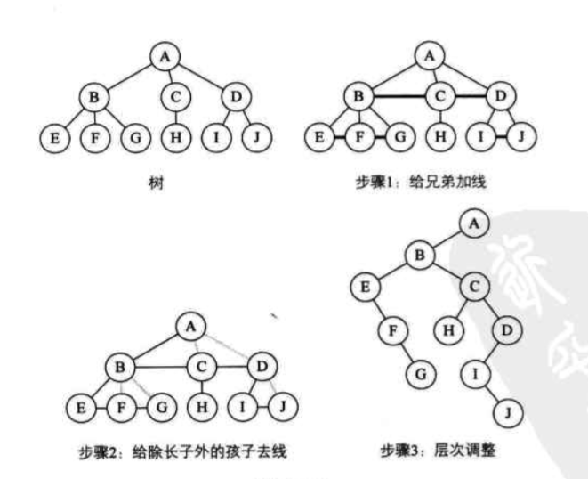


#### 树和森林的遍历

##### 树的遍历

> 把树转化成二叉树

- 先根遍历（类似于二叉树的先序遍历）
- 后根遍历（类似于二叉树的中序遍历）


##### 森林的遍历

> 把森林转化成二叉树

- 先序遍历森林（类似于二叉树的先序遍历）
- 中序遍历森林（类似于二叉树的中序遍历）


### 赫夫曼树

> 转变二叉树来实现用较小的代价来访问到概率大的元素，又叫最优二叉树


#### 生成最右树的方法

现在有一堆概率数：A:5 , B:15 , C:40 , D:30 , E:10

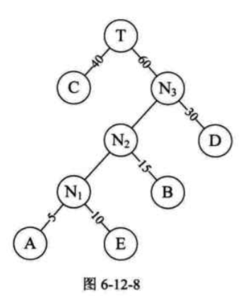


如上图所示，选两个目前最小的数生成N~1~，保证右子树的权值大于左子树，然后这样循环，即可生成

上图二叉树的带权路径长度
$$
40*1+30*2+15*3+10*4+5*4=205
$$


#### 赫夫曼编码

如下图所示

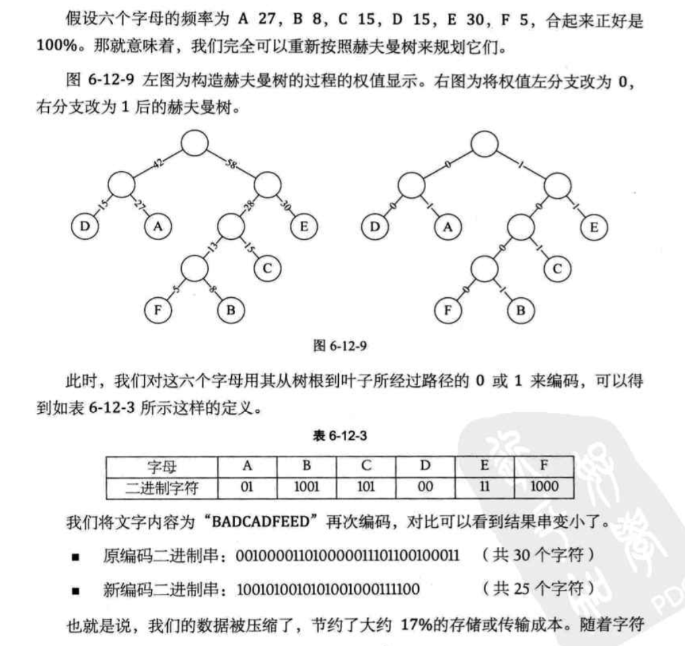


主要思想还是没变，把概率最大的字母用最少的二进制字符来表示，而且每个二进制字符组代表的字母不冲突。


## 图

### 术语

#### G(V,E)

> G表示一个图，V是图的顶点集合，E是图的边集合


#### 无向图

> 顶点之间的边没有方向


#### 有向图

> 顶点之间的边有方向，这种边称为有向边，也称为弧


##### 入度

> 有向边指向顶点V的数量称为入度


##### 出度

> 有向边离开顶点V的数量称为出度


#### 简单图

> 不存在顶点到自身的边，并且没有重复的边的图是简单图


#### 网

> 有权值的图叫做网


#### 连通图

> 图上任意两个顶点都连通，则为连通图


### 图的存储结构

#### 邻接矩阵

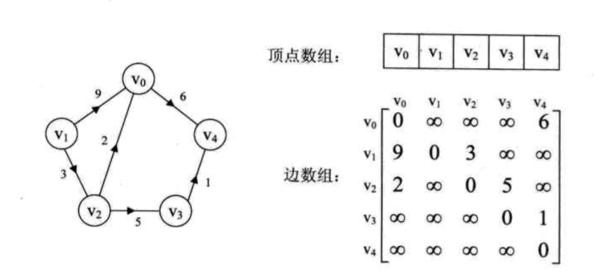

```c
typedef char VertexType;
typedef int EdgeType;
#define MAXSIZE 100
typedef struct
{
  VertexType vexs[MAXSIZE];         //顶点数组
  EdgeType arc[MAXSIZE][MAXSIZE];   //二维数组，边表
  int numVertexes,numEdges;         //顶点数和边数
}MGraph;
```


#### 邻接表


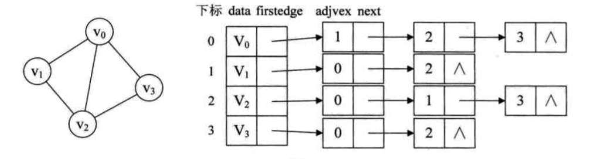


```c
#define MAX_VERTEX_NUM 20
typedef struct ArcNode
{
  int adjvex;   //储存该顶点的下标
  struct ArcNode *nextarc;  //指向下一个邻接点的指针
}ArcNode;
typedef struct VNode
{
  VertexType data;   //顶点信息
  ArcNode *firstarc;  //指向第一个邻接点
}VNode,AdjList[MAX_VERTEX_NUM];
typedef struct
{
  AdjList vertices;
  int vexnum,arcnum;  //顶点数和弧数
}ALGraph;
```


#### 十字链表

> 邻接表是以出度为出发点，逆邻接表是以入度为出发点，那么十字链表就是结合它们两者


##### 顶点结点

| 指向该顶点的入边表的第一个结点 | 数据   | 指向该顶点的出边表的第一个结点 |
| --------------- | ---- | --------------- |
| firstin         | data | firstout        |


##### 弧结点

| 弧起点的下标  | 弧终点的下标  | 指向终点相同的下一条弧 | 指向起点相同的下一条弧 | 数据   |
| ------- | ------- | ----------- | ----------- | ---- |
| tailvex | headvex | hlink       | tlink       | data |


#### 邻接多重表

> 是无向图的另一种链式存储结构


### 图的遍历

#### 深度优先遍历

> 一直递归地遍历第一个顶点的第一个邻接点，直到访问的顶点没有邻接点后，再对第一个顶点的第二个邻接点进行递归遍历，如此循环

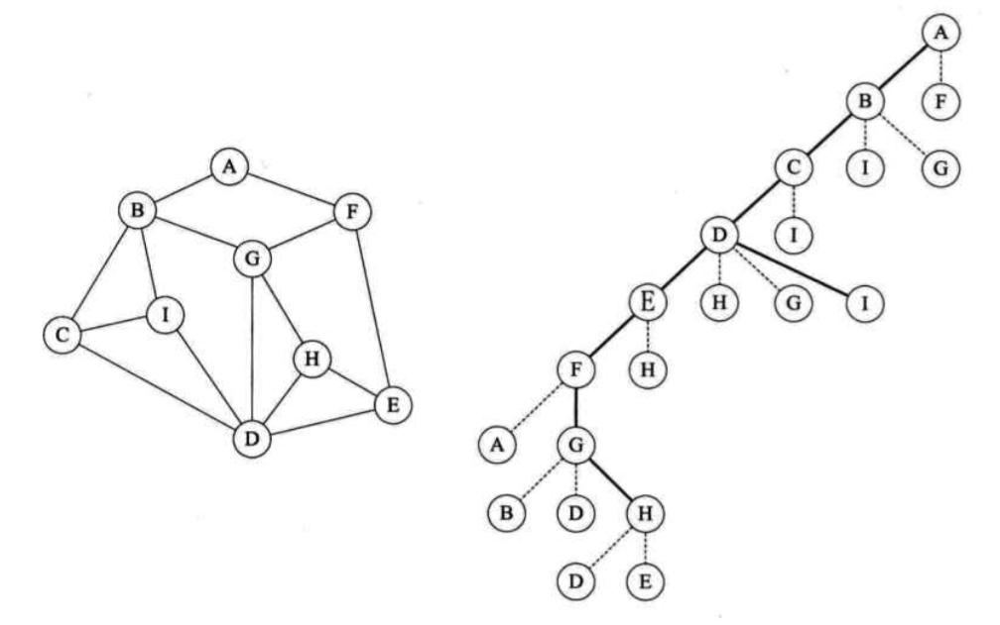

#### 广度优先遍历

> 以顶点为起始点，由近至远，依次访问和顶点路径想通且路径长度分别为1，2……的顶点

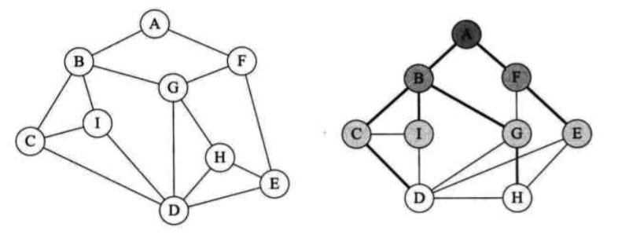


### 最小生成树

> 把各个顶点连接起来的最小代价的树


#### 普里姆（Prim）算法

> 新建一个集合，放入一个顶点，然后选出和这个顶点连通的最短路径的那个顶点，也放进这个集合，然后选出和这两个顶点连通的最短路径的那个顶点，然后再把它放进集合，直到所有的顶点都在集合里了，那最小生成树也出来了


#### 克鲁斯卡尔（Kruskal）算法

> 将图中边按其权值由小到大的次序顺序选取，然后凑出来


#### 速学路径

[http://blog.csdn.net/weinierbian/article/details/8059129/](http://blog.csdn.net/weinierbian/article/details/8059129/)


### 拓扑排序

> 由AOV网构造拓扑序列的拓扑排序算法主要是循环执行以下两步，直到不存在入度为0的顶点为止。
>
> (1) 选择一个入度为0的顶点并输出之；
>
> (2) 从网中删除此顶点及所有出边。
>
> 循环结束后，若输出的顶点数小于网中的顶点数，则输出“有回路”信息，否则输出的顶点序列就是一种拓扑序列。


#### AOV网

> 在有向图中若以顶点表示活动，有向边表示活动之间的先后关系，这样的图简称为AOV网


### 关键路径

> 从源点到汇点的路径长度(各路径上持续时间之和)最长的路径叫关键路径


#### AOE网

> 用顶点表示事件，弧表示活动，弧上的权值表示活动持续的时间的有向图叫AOE网


### 最短路径

#### 迪杰斯特拉（Dijkstra）算法

> 按路径长度递增的次序产生最短路径的算法

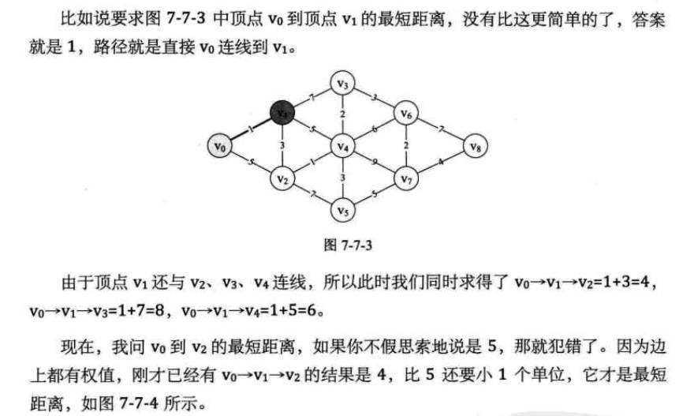


#### 弗洛伊德（Floyd）算法

速学链接

[http://blog.csdn.net/bjtu_dubing/article/details/50333027](http://blog.csdn.net/bjtu_dubing/article/details/50333027)


## 查找

### 术语

#### 关键字

> 是数据元素中某个数据项的值，用它可以标识一个数据元素


### 顺序查找

> 从第一个或者最后一个记录开始，逐个与给定的值进行匹配


### 折半查找

> 二分查找

```c
void binsearch(int *r,int n)						/*折半查找函数*/
{
    int j,data,low=0,high=n,mid,find=0;
    bubblesort(r,n);								/*起泡法排序*/
    for(j=0;j<n;j++)
        printf("%d ",r[j]);							/*排序后输出*/
    printf("please input find data:");				/*提示输入查找数据*/
    scanf("%d",&data);
    while(low<=high&&!find)			    			/*循环查找*/
    {
        mid=(low+high)/2;					    		/*置mid指针*/
        if(data<r[mid])						    	/*判断数据大小，移动指针*/
            high=mid-1;
        else if(data>r[mid])
            low=mid+1;
        else find=1;
    }
    if(!find)
        printf("the data is not found!\n");				/*显示数据没有找到*/
    else printf("the data position is %d",mid+1);		/*输出数据位置*/
    getch();
}
```


### 二叉排序树

>  左子树上的所有结点的值均小于它的根结点的值
>
> 右子树上的所有结点的值均大于它的根结构的值
>
> 它的左右子树也分别为二叉排序树


### 平衡二叉树

> 它的左子树和右子树都是平衡二叉树
>
> 左子树和右子树的深度之差绝对值不超过1
>
> 平衡二叉树的目的就是优化二叉排序树，减小树的深度，便于查找


#### 平衡因子

将二叉树上结点的左子树深度减去右子树深度的值，也只能是-1，0，1


### 哈希表


#### 线性探测法

[http://blog.csdn.net/shangruo/article/details/8491733](http://blog.csdn.net/shangruo/article/details/8491733)


## 排序

### 直接插入排序

> 将一个记录插入到已排好序的有序表中，得到一个新的、记录数增1的有序表

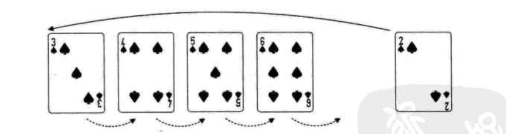

```c
void InsertSort(SqList *L)
{
  int i,j;
  for(i=2;i<=L->length;i++){
    if(L->r[i] < L->r[i-1]){    //如果前者大于后者
      L->r[0]=L->r[i];          //把后者保存在暂存区r[0]里
      for(j=i-1;L->r[j] > L->r[0];j--){
        L->r[j+1]=L->r[j];      //后者放入前者的值，如果前者的前者比暂存区的大，则再次交换
      }
      L->r[j+1]=L->r[0];        //再把暂存区的值拿出来
    }
  }
}
```

时间复杂度为O[n^2^]


### 希尔排序

> 有间隔的直接插入排序

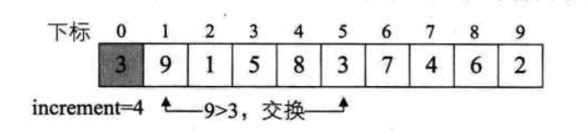

```c
void ShellSort(SQLite *L)
{
  int i,j;
  int increment = L->length;
  do{
    increment = increment/3+1;        //先确定间距
    for(i = increment+1;i<=L->length;i++){
      if(L->r[i] < L->r[i-increment]){        //比较相隔increment的两值大小
        L->r[0]=L->r[i];
        for(j=i-increment;j>0&&L->r[0]<L->r[j];j-=increment){   //和直接插入法一个意思
          L->r[j+increment]=L->r[j];
        }
        L->r[j+increment]=L->r[0];
      }
    }
  }
  while(increment>1)
}
```

当n无穷大的时候，可以减少到n(log~2~n)^2^


### 快速排序

> 选择一个基准，将比起大的数放在一边，小的数放到另一边。对这个数的两边再递归上述方法。

```c
void sort(int *a, int left, int right)
{
    if(left >= right)/*如果左边索引大于或者等于右边的索引就代表已经整理完成一个组了*/
    {
        return ;
    }
    int i = left;
    int j = right;
    int key = a[left];
      
    while(i < j)                               /*控制在当组内寻找一遍*/
    {
        while(i < j && key <= a[j])
        /*而寻找结束的条件就是，1，找到一个小于或者大于key的数（大于或小于取决于你想升
        序还是降序）2，没有符合条件1的，并且i与j的大小没有反转*/ 
        {
            j--;/*向前寻找*/
        }
          
        a[i] = a[j];
        /*找到一个这样的数后就把它赋给前面的被拿走的i的值（如果第一次循环且key是
        a[left]，那么就是给key）*/
          
        while(i < j && key >= a[i])
        /*这是i在当组内向前寻找，同上，不过注意与key的大小关系停止循环和上面相反，
        因为排序思想是把数往两边扔，所以左右两边的数大小与key的关系相反*/
        {
            i++;
        }
          
        a[j] = a[i];
    }
      
    a[i] = key;/*当在当组内找完一遍以后就把中间数key回归*/
    sort(a, left, i - 1);/*最后用同样的方式对分出来的左边的小组进行同上的做法*/
    sort(a, i + 1, right);/*用同样的方式对分出来的右边的小组进行同上的做法*/
                       /*当然最后可能会出现很多分左右，直到每一组的i = j 为止*/
}

```

最好情况是O(nlogn)，最差情况是O(n^2^)且不稳定


### 选择排序

> n-1次的循环比较，然后选出最小数的下标，然后进行交换

```c
void SelectSort(SQList *L)
{
  int i,j,min;
  for(i=1;i<L->length;i++){
    min = i;
    for(j=i+1;j<L->length;j++){
      if(L->r[j] < L->r[min]){
        min = j;
      }
      if(i!=min){
        swap(L,i,min);
      }
    }
  }
}
```


### 冒泡排序

> 两两比较相邻记录的关键字，如果反序则交换

```c
void BubbleSort(SQLite *L)
{
  int i,j;
  for(i=1;i<L->length;i++){
    for(j=L->length;j>=i;j++){   //注意是从末尾开始比较
      if(L->r[j] > l->r[j+1]){
        swap(L,j,j+1);
      }
    }
  }
}
```


### 堆排序

> 大顶堆：每个结点的值都大于等于其左右孩子结点的值
>
> 小顶堆：每个结点的值都小于等于其左右孩子结点的值
>
> 将待排的序列构成一个大顶堆，然后取走堆顶（最大值），然后再调整大顶堆，再取走堆顶，如此往复

最好和最差的情况都是O(nlogn)但不稳定


速学路径

[http://blog.csdn.net/xiaoxiaoxuewen/article/details/7570621/](http://blog.csdn.net/xiaoxiaoxuewen/article/details/7570621/)


### 归并排序

> 把n个有序的子序列两两归并，直到归并成一个序列

最好和最差的情况都是O(nlogn)但稳定


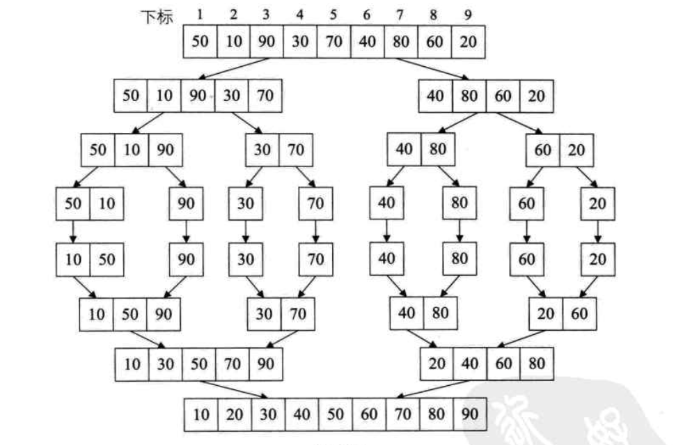


速学路径

[http://blog.csdn.net/yinjiabin/article/details/8265827/](http://blog.csdn.net/yinjiabin/article/details/8265827/)


### 基数排序

> 从序列的个位开始排列，然后到十位开始排列，直到最高的位数

最好和最坏的情况都是O(d(n+rd))


速学路径

[http://blog.chinaunix.net/uid-26722078-id-3668671.html](http://blog.chinaunix.net/uid-26722078-id-3668671.html)

[http://www.cnblogs.com/kkun/archive/2011/11/23/2260275.html](http://www.cnblogs.com/kkun/archive/2011/11/23/2260275.html)